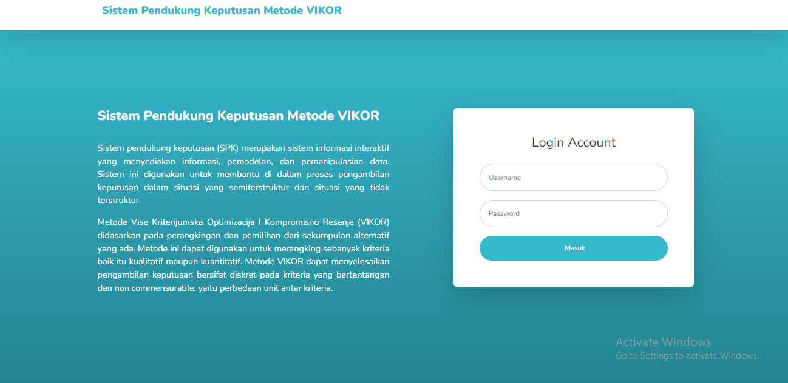
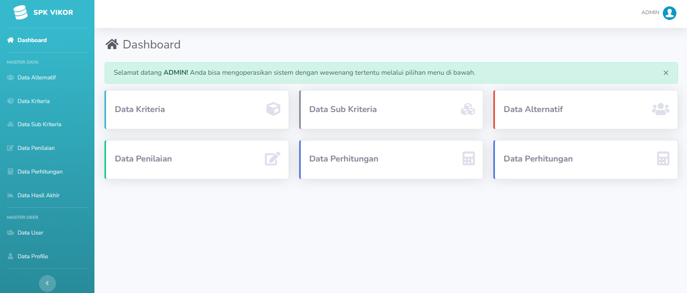

# SISTEM PENDUKUNG KEPUTUSAN PEMILIHAN PRODUK SUNSCREEN BERDASARKAN JENIS KULIT MENGGUNAKAN METODE VIKOR
Sistem Pendukung Keputusan (SPK) adalah sistem yang melalui penggunaan data dan model-model keputusan untuk memecahkan masalah yang sifatnya semi terstruktur maupun yang tidak terstruktur.
# Pembahasan
Melibatkan campur tangan teknologi untuk memilih sunscreen yang sesuai dengan kulit yang berbeda akan sangat cocok. Dimanfaatkan teknologi informasi dalam pengembilan sebuah keputusan untuk memilih sunscreen yang tepat. Sistem Pendukung Keputusan atau SPK ialah salah satu bentuk dari sistem informasi yang memanfaatkan komputer sebagai landasan utama dalam bidang manajemen dan ilmu pengetahuan, dengan tujuan untuk membantu pengambilan keputusan di instansi atau organisasi tertentu. Secara lebih spesifik, SPK merupakan sejenis sistem komputer yang berguna mengubah data menjadi informasi untuk proses pengambilan keputusan terkait dengan terstruktur dan masalah-masalah spesifik penerapan metode SPK menggunakan data penting yang terdiri dari data kriteria dan data alternatif
# Rancangan Tampilan Sistem Pendukung Keputusan Pemilihan Produk Sunscreen Berdasarkan Jenis Kulit:

Untuk lihat tampilan dan informasi lainnya, cek [Document](JURNAL%20SPK%20PEMILIHAN%20SUNSCREEN.docx)
# Anggota
1. Muhammad Riza Aimar
2. Gilang Patoni
3. Lutfi Adytya Rahayu
4. Nurthariqa Octaviani
5. Salsabila
6. Diana Fitri Santoso6

